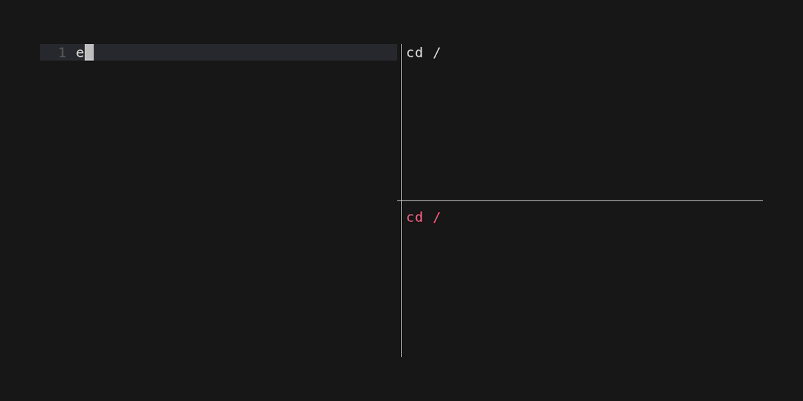

# Oils-readline



Proof-of-concept [oils](https://oils.pub/) readline as a separate process.

It makes use of [Oils Headless mode](https://oils.pub/release/latest/doc/headless.html) which means that every executed command receives a separate Stdin, stdout and stderr.
This is combined with [charms bubbletea](https://github.com/charmbracelet/bubbletea) TUI framework for a nice experience.

It allows us to have a golang tool to handle user input, but forward inputs for commands cleanly to them.
We know exactly what output comes from which command. Stderr is separate from the stdout.
We can manage IO for "background" processes completely independently.
We can forward output to any other program we like.
We control the Input, Highlighting, Autocompletion, etc. 

**All without having to resort to hacky shell hooks**

## optional dependencies

Since the binary wants to contain a static build of oils, it has some optional requirements:
- bash (required for a static oils build)
- gcc
- g++
- wget (to fetch the Oils source code)

It's possible to easily generate (and build) the project in a container.
The `Makefile` has an example for building it using `podman` with an `alpine` container.

**Alternatively it's possible to just create an empty file `fanos/assets/oils-for-unix-static.stripped`.**

When oils is not contained, it needs to be run with an extra argument to use a system oils: `./oils-readline -oil_path $(which ysh)`

The whole logic to build the static oils is in `fanos/static-oils.sh`.

## Build

```shell
# Create a static oils to be embedded
go generate ./...

# If building the static oils fails, you can also do this and use an oils from the environment:
#mkdir -p fanos/assets && touch assets/oils-for-unix-static.stripped

go build
```

Run:

```shell
./oils-readline # uses embedded oils (ysh)
# Bash-like
./oils-readline -oil_path $(which osh)
# New YSH
./oils-readline -oil_path $(which ysh)
```
